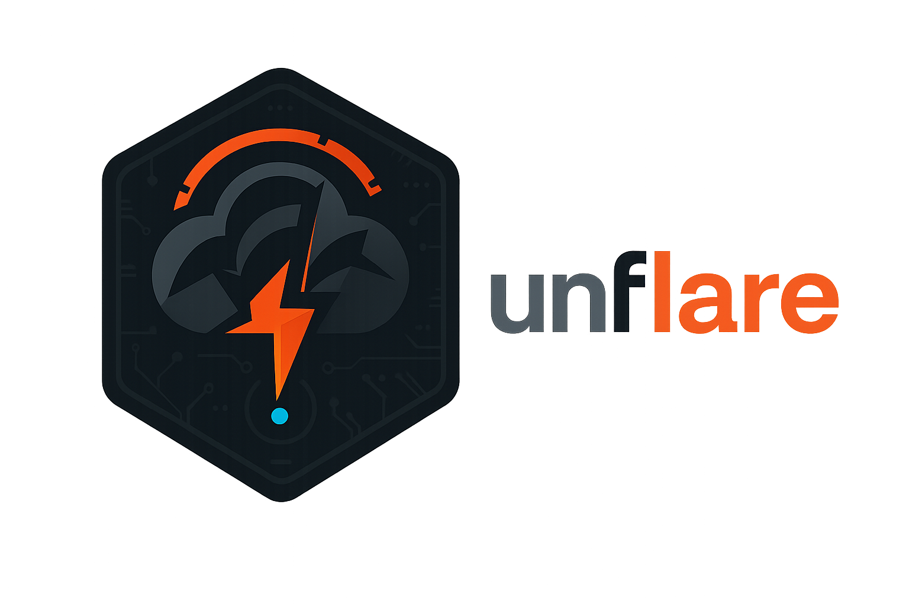

<p align="center">
  
</p>

<h1 align="center">unflare</h1>

<p align="center">
  <a href="https://github.com/copyleftdev/unflare/actions/workflows/ci.yml"></a>
  <a href="https://ziglang.org/"></a>
  <a href="https://opensource.org/licenses/MIT"></a>
</p>

A high-performance Cloudflare intelligence toolkit written in Zig. Zero external dependencies, single static binary.

---

> **🪶 ~750KB binary.** In an era of 100MB+ Electron apps and bloated runtimes, we believe powerful tools should have a small footprint. unflare delivers full functionality in under 1MB — thanks to [Zig](https://ziglang.org/) and the incredible work of [@andrewrk](https://github.com/andrewrk).

---

## Features

| Command | Description |
|---------|-------------|
| `detect` | Multi-signal Cloudflare detection with confidence scoring |
| `probe` | Detailed HTTP response analysis with header highlighting |
| `trace` | Parse /cdn-cgi/trace endpoint data |
| `origin` | Discover origin IPs via subdomain enumeration |
| `favicon` | Generate MMH3 hashes for Shodan/Censys hunting |
| `ipcheck` | Check IPs against CDN/WAF ranges |

## Installation

### Pre-built Binaries

Download from [Releases](https://github.com/copyleftdev/unflare/releases):

```bash
# Linux
curl -LO https://github.com/copyleftdev/unflare/releases/latest/download/unflare-linux-x86_64
chmod +x unflare-linux-x86_64
sudo mv unflare-linux-x86_64 /usr/local/bin/unflare

# macOS
curl -LO https://github.com/copyleftdev/unflare/releases/latest/download/unflare-macos-aarch64
chmod +x unflare-macos-aarch64
sudo mv unflare-macos-aarch64 /usr/local/bin/unflare
```

### From Source

Requires Zig 0.14+.

```bash
git clone https://github.com/copyleftdev/unflare.git
cd unflare
zig build -Doptimize=ReleaseSafe
./zig-out/bin/unflare --help
```

## Quick Start

```bash
# Detect Cloudflare
unflare detect cloudflare.com

# Find origin IPs behind Cloudflare
unflare origin example.com

# Get favicon hash for Shodan hunting
unflare favicon github.com

# Check if IPs are CDN/WAF protected
unflare ipcheck 104.16.1.1 8.8.8.8
```

## Examples

### Cloudflare Detection

```
$ unflare detect cloudflare.com

╭─────────────────────── Cloudflare Detection ────────────────────────╮
│   Target        cloudflare.com                                      │
│   Status        ✓ CLOUDFLARE DETECTED                               │
│   Confidence    75%                                                 │
│   Signals       4 detected                                          │
╰─────────────────────────────────────────────────────────────────────╯
  Datacenter: LAX (Los Angeles, US)
```

### Origin Discovery

```
$ unflare origin example.com

┌─────────────────────────────────────────────────────────────────┐
│ Target Analysis                                                 │
├─────────────────────────────────────────────────────────────────┤
│ Target IP:      104.16.132.229                                  │
│ Status:         ✓ Behind Cloudflare                             │
│ Subdomains:     35 checked                                      │
└─────────────────────────────────────────────────────────────────┘

🎯 Potential Origin IPs (2 found):
│ 192.168.1.100    │ mail.example.com     │   80%       │
```

### Favicon Hash for Shodan

```
$ unflare favicon github.com

┌─────────────────────────────────────────────────────────────────┐
│ Favicon Analysis                                                │
├─────────────────────────────────────────────────────────────────┤
│ MMH3 Hash:      1848946384                                      │
└─────────────────────────────────────────────────────────────────┘

Search Queries:
  Shodan:  http.favicon.hash:1848946384
```

## Contributing

See [CONTRIBUTING.md](CONTRIBUTING.md) for guidelines on:
- Submitting issues and bug reports
- Code style and architecture guidelines
- Pull request process

## Legal

This tool is for **authorized security testing only**. Always obtain proper authorization before testing third-party infrastructure.

## License

[MIT](LICENSE)
